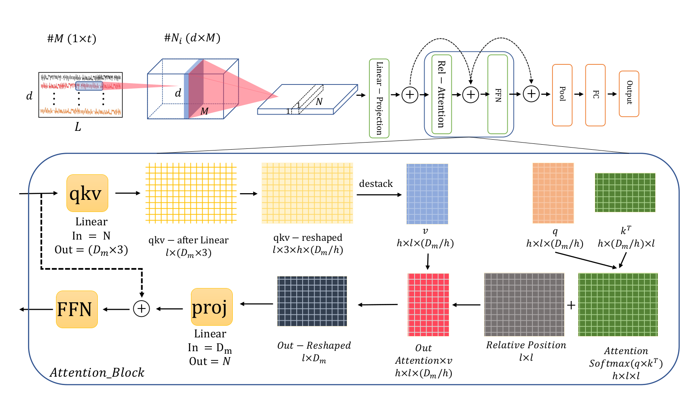

## Improving Position Encoding of Transformers for Multivariate Time Series Classification (ConvTran) [[Cite](#citation)]
#### Authors: [Navid Mohammadi Foumani](https://www.linkedin.com/in/navid-foumani/), [Chang Wei Tan](https://changweitan.com/), [Geoffrey I. Webb](https://i.giwebb.com/), [Mahsa Salehi](https://research.monash.edu/en/persons/mahsa-salehi)

#### 🏆 **Best Paper Award** 🏆: Selected among the [🌟best papers🌟](https://2023.ecmlpkdd.org/program/paper-session-overview/program-20-september-2023/) in the Journal Track of #ECML_PKDD2023!
#### ✨ **News:** This work has been accepted for publication in [Data Mining and Knowledge Discovery](https://link.springer.com/article/10.1007/s10618-023-00948-2).

#### ConvTran Paper: [PDF](https://link.springer.com/content/pdf/10.1007/s10618-023-00948-2.pdf)

This is a PyTorch implementation of Improving Position Encoding of Transformers for Multivariate Time Series Classification (ConvTran)
<p align="center">
    
</p>    
## Overview 

<p align="justify">
The question of whether absolute position encoding, relative position encoding, or a combination of both is more suitable for capturing the sequential nature of time series data remains unresolved. To bridge this gap, our paper reviews existing absolute and relative position encoding methods applied in time series classification. Additionally, we propose two novel position encoding techniques: time Absolute Position Encoding (tAPE) and efficient Relative Position Encoding (eRPE).
</p>

### Key Idea of Position Encoding of Transformers for MTSC
#### time Absolute Position Encoding (tAPE)
<p align="justify">
The original proposal of absolute position encoding was primarily intended for language modeling, where position embeddings with high dimensions, such as 512 or 1024, are commonly utilized for inputs of length 512. The figure below illustrates the dot product between two sinusoidal positional embeddings at a distance of K, using different embedding dimensions.
</p>

<p align="justify">
It is evident that higher embedding dimensions, such as 512 (indicated by the red thick line), provide a more accurate reflection of the similarity between different positions. Conversely, when employing lower embedding dimensions, such as 64 or 128 (represented by the thin blue and orange lines, respectively), the dot product does not consistently decrease as the distance between positions increases. This phenomenon, known as the "distance awareness" property, is present in higher dimensions but diminishes with lower embedding dimensions, such as 64.
</p>
<pre>
<code>
class tAPE(nn.Module): # Equation 13 page 11
    def __init__(self, d_model, dropout=0.1, max_len=1024, scale_factor=1.0):
        super(timeAPE, self).__init__()
        self.dropout = nn.Dropout(p=dropout)
        pe = torch.zeros(max_len, d_model)  # positional encoding
        position = torch.arange(0, max_len, dtype=torch.float).unsqueeze(1)
        div_term = torch.exp(torch.arange(0, d_model, 2).float() * (-math.log(10000.0) / d_model))
        pe[:, 0::2] = torch.sin((position * div_term)*(d_model/max_len))
        pe[:, 1::2] = torch.cos((position * div_term)*(d_model/max_len))
        pe = scale_factor * pe.unsqueeze(0)
        self.register_buffer('pe', pe)  # this stores the variable in the state_dict (used for non-trainable variables)
    def forward(self, x):
        x = x + self.pe
        return self.dropout(x)
</code>
</pre>
<p align="justify">
Without our modification, as series length $L$ increases the dot product of positions becomes ever less regular, resulting in a loss of distance awareness. By incorporating the length parameter in the frequency terms in both sine and cosine functions, the dot product remains smoother with a monotonous trend. As the embedding dimension $d_{model}$ value increases, it is more likely the vector embeddings are sampled from low-frequency sinusoidal functions, which results in the anisotropic phenomenon. To alleviate this, we incorporate the $d_{model}$ parameter into the frequency term in both sine and cosine functions
</p>
<p align="center">

</p>

#### efficient Relative Position Encoding (eRPE)
<p align="justify">
Theoretically, there are many possibilities for integrating relative position information into the attention matrix, but we empirically found that attention models perform better when we add the relative position to the model after applying the softmax to the attention matrix. We presume this is because the position values will be sharper without the softmax. And sharper position embeddings seems to be beneficial in TSC task as it emphasizes more on informative relative positions for classification compared to existing models in which softmax is applied to relative position embeddings.
</p>
<p align="justify">
To implement the efficient version of eRFE for input time series with a length of $L$, for each head, we create a trainable parameter $w$ of size $2L-1$, as the maximum distance is $2L-1$. Then for two position indices $i$ and $j$, the corresponding relative scalar is $w_{i-j+L}$ where indexes start from 1 instead of 0 (1-base index). Accordingly, we need to index $L^2$ elements from $2L-1$ vector. 
</p>
<p align="center">

</p>
<pre>
<code>
class eRPE(nn.Module): # Equation 14 page 12
    def __init__(self, emb_size, num_heads, seq_len, dropout):
        super().__init__()
        self.seq_len = seq_len
        self.num_heads = num_heads
        self.scale = emb_size ** -0.5
        self.key = nn.Linear(emb_size, emb_size, bias=False)
        self.value = nn.Linear(emb_size, emb_size, bias=False)
        self.query = nn.Linear(emb_size, emb_size, bias=False)
        self.relative_bias_table = nn.Parameter(torch.zeros((2 * self.seq_len - 1), num_heads))
        coords = torch.meshgrid((torch.arange(1), torch.arange(self.seq_len)))
        coords = torch.flatten(torch.stack(coords), 1)
        relative_coords = coords[:, :, None] - coords[:, None, :]
        relative_coords[1] += self.seq_len - 1
        relative_coords = rearrange(relative_coords, 'c h w -> h w c')
        relative_index = relative_coords.sum(-1).flatten().unsqueeze(1)
        self.register_buffer("relative_index", relative_index)
        self.dropout = nn.Dropout(dropout)
        self.to_out = nn.LayerNorm(emb_size)
    def forward(self, x):
        batch_size, seq_len, _ = x.shape
        k = self.key(x).reshape(batch_size, seq_len, self.num_heads, -1).permute(0, 2, 3, 1)
        v = self.value(x).reshape(batch_size, seq_len, self.num_heads, -1).transpose(1, 2)
        q = self.query(x).reshape(batch_size, seq_len, self.num_heads, -1).transpose(1, 2)
        # k,v,q shape = (batch_size, num_heads, seq_len, d_head)
        attn = torch.matmul(q, k) * self.scale
        attn = nn.functional.softmax(attn, dim=-1) # attn shape (seq_len, seq_len)
        # Use "gather" for more efficiency on GPUs
        relative_bias = self.relative_bias_table.gather(0, self.relative_index.repeat(1, 8))
        relative_bias = rearrange(relative_bias, '(h w) c -> 1 c h w', h=1 * self.seq_len, w=1 * self.seq_len)
        attn = attn + relative_bias
        out = torch.matmul(attn, v)
        out = out.transpose(1, 2) # out.shape = (batch_size, num_heads, seq_len, d_head)
        out = out.reshape(batch_size, seq_len, -1) # out.shape == (batch_size, seq_len, num_heads, d_head)
        out = self.to_out(out) # out.shape == (batch_size, seq_len, d_model)
        return out
</code>
</pre>

## Datasets
We evaluated the ConvTran model using a combination of 30 datasets from the UEA archive and two additional datasets, Actitracker HAR and Ford. To obtain these datasets, you have two options:
### Manual download:
You can manually download the datasets using the provided link and place them into the pre-made directory.

UEA: https://www.timeseriesclassification.com/aeon-toolkit/Archives/Multivariate2018_ts.zip
Copy the datasets folder to: Datasets/UEA/

HAR : https://www.cis.fordham.edu/wisdm/dataset.php
Copy the ActivityRecognition.txt file to : Datasets/Segmentation/ActivityRecognition/

Ford: https://www.kaggle.com/competitions/stayalert/data
Copy the FordChallenge_TEST.csv and FordChallenge_Train.csv to : Datasets/Segmentation/FordChallenge
(Please refer to the "Dataset/Segmentation/Segmentation.txt" file for detailed instructions)

### Automated setup:
Alternatively, you can run the `main.py` function, which will automatically download and prepare the data for immediate use. The main function allows you to choose between two dataset options: `Dataset/UEA/`.

Additionally, it's important to note that the Ford datasets were obtained from Kaggle. To download them, you will need to register on Kaggle and manually download the datasets. Once downloaded, please place them in the 'Dataset/Large/FordChallenge/' directory.


## Setup

_Instructions refer to Unix-based systems (e.g. Linux, MacOS)._

This code has been tested with `Python 3.7` and `3.8`.

`pip install -r requirements.txt`

## Run

To see all command options with explanations, run: `python main.py --help`
In `main.py` you can select the datasets and modify the model parameters.
For example:

`self.parser.add_argument('--epochs', type=int, default=10, help='Number of training epochs')`

or you can set the paprameters:

`python main.py --epochs 1500 --data_dir Datasets/UEA/`

## Citation
If you find **ConvTran** useful for your research, please consider citing this paper using the following information:

````
```
@article{ConvTran2023,
  title={Improving position encoding of transformers for multivariate time series classification},
  author={Foumani, Navid Mohammadi and Tan, Chang Wei and Webb, Geoffrey I and Salehi, Mahsa},
  journal={Data Mining and Knowledge Discovery},
  volume={38},
  number={1},
  pages={22--48},
  year={2024},
  publisher={Springer}
}

```
````

## Credits

Some parts of the Code are taken from [TST](https://github.com/gzerveas/mvts_transformer).
